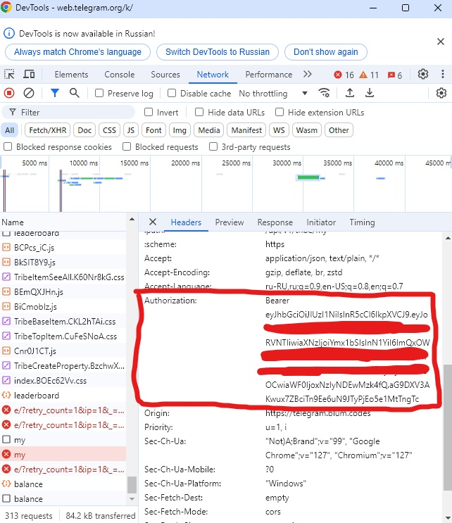
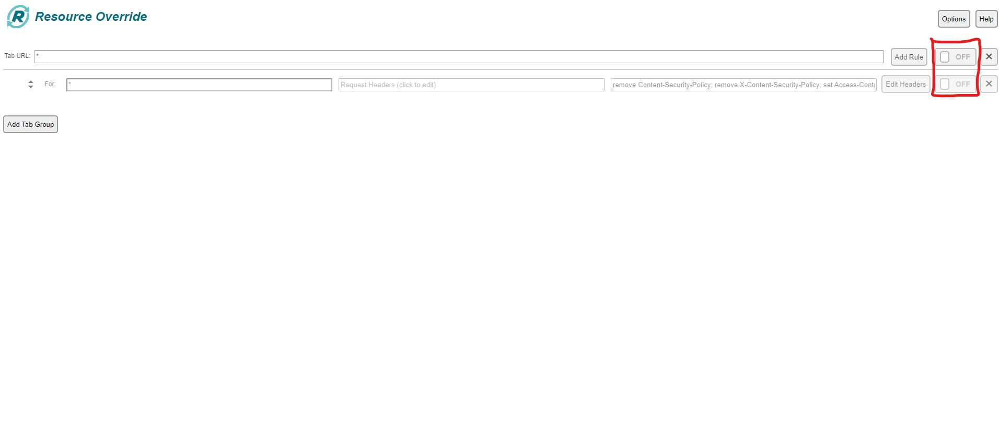

# Blum auto play game

A script that will play mini game in Blum for you, using your tickets and collecting blum points

# Usage

1. Install Node.js and npm if you haven't already
2. Clone the repository and go to the folder
3. Copy your Blum `Bearer token` and paste it in the `src/helpers/api.js` file at `const authToken = "<your_token>";`
4. Install the dependencies by running `npm install`
5. Run the script by running `npm start`

# Functionality

- Starts a new game
- Collects a random number of points between 170 and 195
- Waits a random amount of time between 30 and 35 seconds
- Claims the points
- If an error occurs, waits 5 seconds and retries
- If the token is invalid, logs an error and exits
- If the number of tickets is 0, logs an error and exits

# Note:

First off all you need to install [Resource Override](https://chromewebstore.google.com/detail/resource-override/pkoacgokdfckfpndoffpifphamojphii?utm_source=ext_app_menu) Chrome extension. Than click `Add Rule` button and select `Change Headers`. In the `For` input field type `*` for convenience. After that click `Edit Headers` and select `Enable CORS, Allow Frames and Allow Outside Content` in Presets dropdown then click `Close`.

Open `web telegram` and `DevTools`. Then start the blum. In `Network` tab you will find your Bearer token. Copy the token with the word `Bearer`.

# Final step

After mining make sure that you turned off the [Resource Override](https://chromewebstore.google.com/detail/resource-override/pkoacgokdfckfpndoffpifphamojphii?utm_source=ext_app_menu) extension.

<h1 style="color: red;">If you don’t turn it off, you’ll have problems with sites like YouTube!</h1>

# Happy mining!

---

# Блум автоматический игровой процесс

Скрипт, который будет играть за вас в мини-игру в Blum, используя ваши билеты и собирая очки Blum.

# Использование

1. Установите Node.js и npm, если вы ещё не установили
2. Клонируйте репозиторий и переходите в папку
3. Копируйте ваш Blum `Bearer token` и вставляйте его в файл `src/helpers/api.js` в поле `const authToken = "<your_token>";`
4. Установите зависимости, запустив `npm install`
5. Запустите скрипт, запуская `npm start`

# Функциональность

- Начинает новый игровой процесс
- Собирает случайное количество баллов между 170 и 195
- Ожидает случайное количество времени между 30 и 35 секунд
- Объявляет баллы
- Если возникнет ошибка, ожидает 5 секунд и повторяет
- Если токен недействителен, логирует ошибку и выходит
- Если количество билетов 0, логирует ошибку и выходит

# Примечание:

Прежде всего вам нужно установить расширение Chrome [Resource Override](https://chromewebstore.google.com/detail/resource-override/pkoacgokdfckfpndoffpifphamojphii?utm_source=ext_app_menu). Затем нажмите кнопку `Add Rule` и выберите `Change Headers`. В поле `For` введите `*` для удобства. Далее нажмите `Edit Headers` и выберите `Enable CORS, Allow Frames and Allow Outside Content` в списке предустановленных параметров. Затем нажмите `Close`.

Откройте `веб-телеграм` и `DevTools`. Затем запустите Блум. На вкладке `Network` вы найдете свой токен. Скопируйте токен со словом `Bearer`.

# Финальный шаг

После майнинга убедитесь, что вы выключили [Resource Override](https://chromewebstore.google.com/detail/resource-override/pkoacgokdfckfpndoffpifphamojphii?utm_source=ext_app_menu) расширение.

<h1 style="color: red;">Если вы не выключили расширение, вы получите проблемы с сайтами, такими как YouTube!</h1>

# Приятного майнинга!
